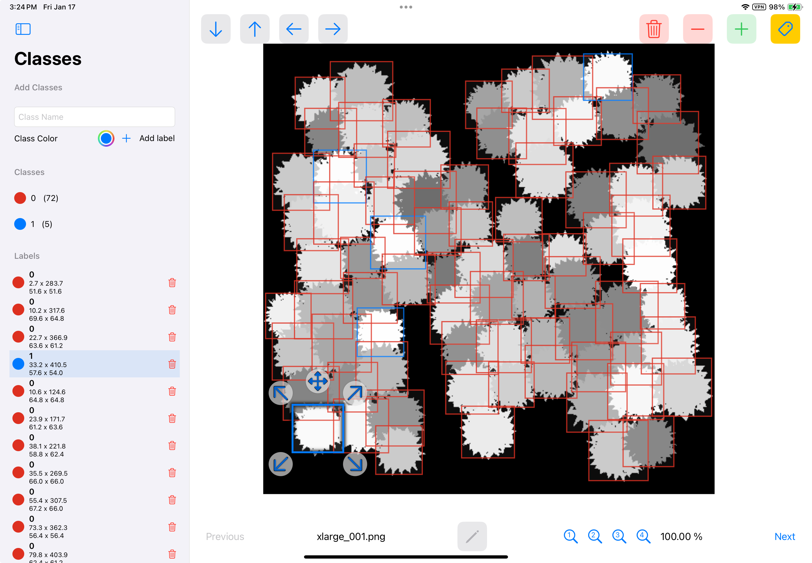

# Image Dataset Labeling App



## Overview
This app is designed for creating and viewing labeled image datasets, specifically with bounding boxes. It is tailored for iPads and offers full support for Apple Pencil, ensuring precise and intuitive labeling. It can also be used on iPhones with touch input, providing versatility for users on the go. Currently, the Mac version offers limited functionality, only allowing dataset viewing, though this feature is still in development.

## Key Features
- **Intuitive Labeling Tools**: Create bounding boxes with ease using the Apple Pencil or touch gestures.
- **Cross-Device Support**: Optimized for iPad, functional on iPhone, and limited viewing capabilities on Mac.
- **Dataset Management**: Organize labeled data efficiently with clear visual and textual indicators of classes and labels.

## Current Limitations
- Mac functionality is restricted to viewing datasets, and even this is not fully polished.

## Getting Started
### Installation
<!-- If you have an App Store link, replace the steps below with the App Store download instructions. -->
1. Clone this repository:
   ```bash
   git clone https://github.com/duszekjk/labels.git
   ```
2. Open the project in Xcode.
3. Build and run the app on your iPad or iPhone.

### Usage
1. Launch the app on your iPad or iPhone.
2. Import an image dataset or start labeling a new one.
3. Use the Apple Pencil or touch gestures to draw bounding boxes and assign classes.

## Planned Features
- **Mac Enhancements**: Improved functionality for viewing and editing datasets.
- **AI-Assisted Labeling**: Integration of machine learning models to assist with bounding box generation.
- **Export Options**: Seamless compatibility with TensorFlow, PyTorch, and other machine learning frameworks.
- **Additional Annotation Types**: Support for polygons, key points, and semantic segmentation.

## License
All rights reserved. This app and its contents are the sole property of the developer. Unauthorized distribution, modification, or reverse engineering is strictly prohibited.

## Contact
For questions or feedback, please reach out via [Support](mailto:apps@duszekjk.com).

